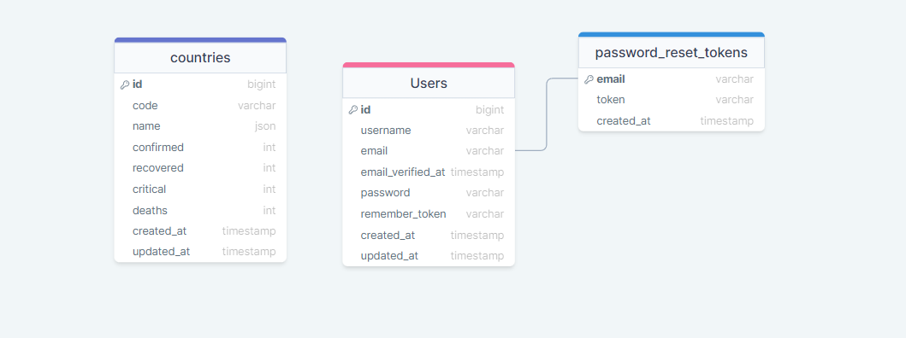

  <h1 style="top: -6px" >Coronatime Project</h1>


---
 CoronaTime is a web application that allows users to register, log in, and view daily COVID-19 statistics. The application features email verification during the registration process, as well as a password reset function. The COVID-19 statistics are automatically updated every day, providing users with the latest information about the pandemic. 

#
### Table of Contents
* [Prerequisites](#prerequisites)
* [Tech Stack](#tech-stack)
* [Getting Started](#getting-started)
* [Migrations](#migration)
* [Development](#development)
* [Project Structure](#project-structure)

#
### Prerequisites

*  *PHP@7.2 and up*
*  *MYSQL@8 and up*
*  *npm@6 and up*
*  *composer@2 and up*


#
### Tech Stack

*  [Laravel@6.x](https://laravel.com/docs/6.x) - back-end framework
*  [Spatie Translatable](https://github.com/spatie/laravel-translatable) - package for translation

#
### Getting Started
1\. First of all you need to clone E Space repository from github:
```sh
git clone https://github.com/RedberryInternship/dato-papismedovi-movie-quotes.git
```

2\. Next step requires you to run *composer install* in order to install all the dependencies.
```sh
composer install
```

3\. after you have installed all the PHP dependencies, it's time to install all the JS dependencies:
```sh
npm install
```

and also:
```sh
npm run dev
```
in order to build your JS/SaaS resources.

4\. Now we need to set our env file. Go to the root of your project and execute this command.
```sh
cp .env.example .env
```
And now you should provide **.env** file all the necessary environment variables:

#
**MYSQL:**
>DB_CONNECTION=mysql
>DB_HOST=127.0.0.1
>DB_PORT=3306
>DB_DATABASE=*****
>DB_USERNAME=*****
>DB_PASSWORD=*****

#
**SMTP:**
>MAIL_DRIVER=smtp
>MAIL_HOST=smtp.gmail.com
>MAIL_PORT=587
>MAIL_USERNAME=your_email@gmail.com
>MAIL_PASSWORD=your_email_password
>MAIL_ENCRYPTION=tls


after setting up **.env** file, execute:
```sh
php artisan config:cache
```
in order to cache environment variables.

5\. Now execute in the root of you project following:
```sh
  php artisan key:generate
```
Which generates auth key.

6\. Execute in the root of you project following:
```sh
  php artisan storage:link
```
Which creates the symbolic link.

##### Now, you should be good to go!


#
### Migration
if you've completed getting started section, then migrating database if fairly simple process, just execute:
```sh
php artisan migrate
```

#
### Create User
To update the countries table with data from an API, you can use the following command in your terminal:
```sh
php artisan countries:update
```
This will retrieve data from https://devtest.ge/countries and use it to update the countries table in your database. The command will also retrieve additional statistics data for each country by making parallel requests to https://devtest.ge/get-country-statistics using Http::pool().


#
### Development

You can run Laravel's built-in development server by executing:

```sh
  php artisan serve
```

when working on JS you may run:

```sh
  npm run dev
```
it builds your js files into executable scripts.


#
### Project Structure

```bash
├─── app
│   ├─── Console
│   ├─── Enums
│   ├─── Exceptions
│   ├─── Http
│   ├─── Models
│   ├─── Providers
├─── bootstrap
├─── config
├─── database
├─── lang
├─── node-modules
├─── public
├─── resources
├─── routes
├─── storage
├─── tests
- .env
- artisan
- composer.json
- package.json
- phpunit.xml
```

Project structure is fairly straitforward(at least for laravel developers)...

For more information about project standards, take a look at these docs:
* [Laravel](https://laravel.com/docs/6.x)

[DrawSQL link](https://drawsql.app/teams/datos-team-2/diagrams/coronatime)

